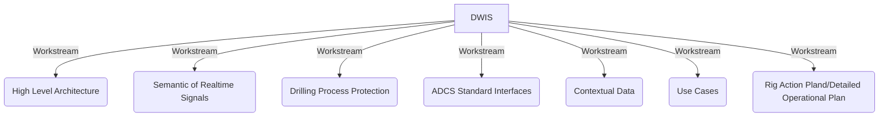

# DWIS Repository Navigator

This index lists each repository in this folder with its README headline (or a note if none). Click a link to jump into that repo.

## DWIS Workstreams



- [Overall](https://github.com/D-WIS/Overall/) - An overall repo for general DWIS project documents
- [HighLevelArchitecture](https://github.com/D-WIS/HighLevelArchitecture/) - DWIS project repo for the workstream "High Level Architecture"
- [ContextualData](https://github.com/D-WIS/ContextualData/) - The DWIS Project repo for the Workstream "Contextual Data"
- [SemanticDrillingRTSignals](https://github.com/D-WIS/SemanticDrillingRTSignals/) - The DWIS Project repo for the Workstream "Semantic of RT Signals"
- [RigOS-DrillingProcessProtection](https://github.com/D-WIS/RigOS-DrillingProcessProtection/) - The DWIS project repo for the workstream "Drilling Process Protection"
- [RigOSAPI](https://github.com/D-WIS/RigOSAPI/) - The DWIS Project repo for the workstream ADCS Interfaces
- [UseCases](https://github.com/D-WIS/UseCases/) - The DWIS Project repo for the workstream "Use Cases"
- [ProjectSTUPID](https://github.com/D-WIS/ProjectSTUPID/) - A repo for working on Rig Action Plan or Detailed Operational Plan

## Main Code
```mermaid
flowchart LR
    %% CENTRAL SYSTEM
    subgraph DWIS[DWIS]
        BB[Blackboard]

        DPSI[Drilling Process<br/>State Interpreter]
        CDB[Contextual Data<br/>Builder]
        AC[Advice Composer]
        SCH[Scheduler]
        LOG[Logger]
        ADCScap[ADCS Capabilities]
        ADCSint[ADCS Interfaces]

        %% Internal data flows to/from Blackboard
        DPSI --> BB
        CDB --> BB
        AC --> BB
        SCH --> BB
        LOG --> BB
    end
    %% EXTERNAL ACTORS / SYSTEMS

    subgraph Advisors[External Advisors]
        Adv1[Advisor #1]
        AdvN[Advisor #n]
    end

    subgraph ADCS_grp[ADCS]
        ADCS1[ADCS #1]
        ADCSq[ADCS #q]
    end

    subgraph DCS_grp[DCS]
        DCS1[DCS #1]
        DCSq[DCS #q]
    end

    subgraph DAQ_grp[Data Acquisition DAQ]
        DAQ1[DAQ #1]
        DAQm[DAQ #m]
    end

    subgraph Ctx_grp[Contextual Data Sources]
        CD1[Contextual Data #1]
        CDp[Contextual Data #p]
    end

    subgraph Rig_grp[Rig Machines]
        RM1[Rig Machines #1]
        RMq[Rig Machines #q]
    end

    OEM[OEM]

    %% CONNECTIONS TO DWIS VIA INTERFACES / FUNCTIONS

    %% ADCS & DCS talk to DWIS via ADCS Interfaces
    ADCS1 --> ADCSint
    ADCSq --> ADCSint
    DCS1 --> ADCSint
    DCSq --> ADCSint
    ADCSint --> ADCScap

    %% Advisors use Advice Composer
    Adv1 --> AC
    AdvN --> AC

    %% DAQ & Contextual Data feed Contextual Data Builder
    DAQ1 --> CDB
    DAQm --> CDB
    CD1 --> CDB
    CDp --> CDB

    %% Rig Machines inform Drilling Process State Interpreter
    RM1 --> DPSI
    RMq --> DPSI

    %% OEM relation to equipment/systems
    OEM --- ADCS_grp
    OEM --- DCS_grp
    OEM --- Rig_grp

    %% Label for group of external systems
    classDef groupLabel fill=none,stroke=none,color=black;
    ExtLabel[External Advisor, Data-Acquisition System,<br/>Contextual Data Sources]:::groupLabel

    ExtLabel --- Advisors
    ExtLabel --- DAQ_grp
    ExtLabel --- Ctx_grp

```
### Common Code
- [Common](https://github.com/D-WIS/Common/) - Common classes for DWIS
- [SemanticAndLogicalStatement](https://github.com/D-WIS/SemanticAndLogicalStatement/) - Classes used to define semantically logical statements
- [SemanticAndStateAutomata](https://github.com/D-WIS/SemanticAndStateAutomata/) - Classes used to define semantically finite State Automata

### Blackboard
- [DDHub-Semantic-Interoperability](https://github.com/D-WIS/DDHub-Semantic-Interoperability/) - DWIS Semantic vocubulary
- [DWIS-Blackboard-Base](https://github.com/D-WIS/DWIS-Blackboard-Base/) - Base code for the DWIS Blackboard
- [DWIS-Blackboard-Clients](https://github.com/D-WIS/DWIS-Blackboard-Clients/) - Clients for DWIS Blackboard
- [DWIS-Blackboard-Samples](https://github.com/D-WIS/DWIS-Blackboard-Samples/) - Samples for the DWIS Blackboard
- [DWIS-Blackboard-Server](https://github.com/D-WIS/DWIS-Blackboard-Server/) - DWIS Blackboard server
- [Semantic-Server-Deploy](https://github.com/D-WIS/Semantic-Server-Deploy/) - Blackboard deployment

### Microstate Engine
- [MicroStateEngine](https://github.com/D-WIS/MicroStateEngine/) - DWIS Microstates Engine

### Scheduler
- [Scheduler](https://github.com/D-WIS/Scheduler/) - The DWIS Scheduler

### Composer
- [AdviceComposer](https://github.com/D-WIS/AdviceComposer/) - DWIS Advice Composer

### ADCS Capability Descriptions
- [RigOS-Capabilities](https://github.com/D-WIS/RigOS-Capabilities/) - Classes used to define the ADCS function capabilities
- [RigOS-Controller-Capabilities](https://github.com/D-WIS/RigOS-Controller-Capabilities/) - Classes used to define the specific ADCS capabilities for Controller functions
- [RigOS-FDIR-Capabilities](https://github.com/D-WIS/RigOS-FDIR-Capabilities/) - Classes used to define the specific ADCS capabilities for Fault Detection Isolation and Recovery
- [RigOS-Procedure-Capabilities](https://github.com/D-WIS/RigOS-Procedure-Capabilities/) - Classes used to define the specific ADCS Capabilities for standard drilling procedures
- [RigOS-SOE-Capabilities](https://github.com/D-WIS/RigOS-SOE-Capabilities/) - Classes used to define the specific ADCS capabilities for safe operating envelopes

### ADCS Bridges
- [ADCSBridgeDEAL](https://github.com/D-WIS/ADCSBridgeDEAL) - ADCS Bridge  for DEAL from HMH (Private)
- [ADCSBridgeGeneric](https://github.com/D-WIS/ADCSBridgeGeneric/) - Generic ADCS Bridge (used for BTWN)
- [ADCSBridgeNOVOS](https://github.com/D-WIS/ADCSBridgeNOVOS/) - ADCS Bridge  for NOVOS from NOV (Private)

## Additional Code for Side and Obsolete Projects, Demo Preparation, ...
- [DDHub-DSID-WP2-Common](https://github.com/D-WIS/DDHub-DSID-WP2-Common/) - Many test projects used during development
- [DWIS-demo-2024-openlab](https://github.com/D-WIS/DWIS-demo-2024-openlab/) - The applications used during the preparation of the 2024 DWIS demonstration
- [DWIS-demo-2024-openlab-adcs](https://github.com/D-WIS/DWIS-demo-2024-openlab-adcs/) - The DWIS to OpenLab drilling access used during the preparation of the 2024 DWIS demonstration
- [DWIS-demo-2024-web](https://github.com/D-WIS/DWIS-demo-2024-web/) - The DWIS web interface used during the 2024 DWIS demonstration 
- [DWIS-NOVOS-Clients](https://github.com/D-WIS/DWIS-NOVOS-Clients/) - Clients for the DWIS NOVOS bridge
- [eRAPAdvisor](https://github.com/D-WIS/eRAPAdvisor/) - an eRAP Advisor
- [RigOS-Viewer-Capabilities](https://github.com/D-WIS/RigOS-Viewer-Capabilities/) - A viewer for ADCS Capabilities
- [WP2_MUMA](https://github.com/D-WIS/WP2_MUMA/) - Code for an associated project about mud management.
- [ADCSSoftwareInterface](https://github.com/D-WIS/ADCSSoftwareInterface/) - OpenRDM
- [D-WIS.github.io](https://github.com/D-WIS/D-WIS.github.io/) - The first web page for the DWIS project. Now replaced by [D-WIS.org](https://d-wis.org/)

