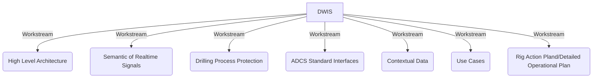
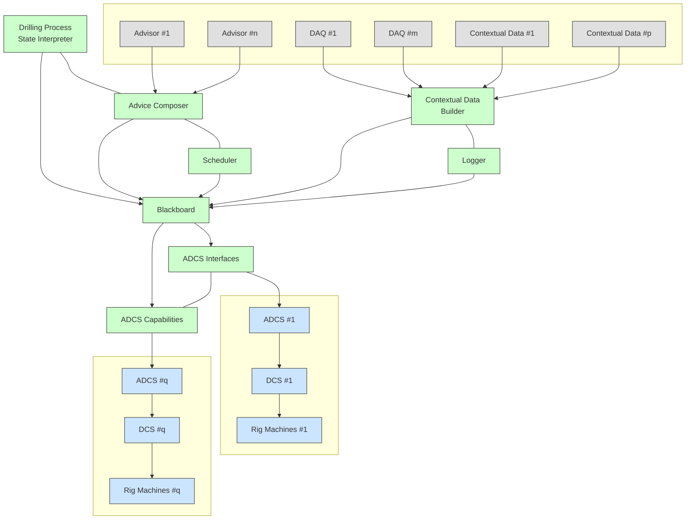

# DWIS Repository Navigator

This index lists each repository in this folder with its README headline (or a note if none). Click a link to jump into that repo.

## DWIS Workstreams

- [Overall](https://github.com/D-WIS/Overall/) - An overall repo for general DWIS project documents
- [HighLevelArchitecture](https://github.com/D-WIS/HighLevelArchitecture/) - DWIS project repo for the workstream "High Level Architecture"
- [ContextualData](https://github.com/D-WIS/ContextualData/) - The DWIS Project repo for the Workstream "Contextual Data"
- [SemanticDrillingRTSignals](https://github.com/D-WIS/SemanticDrillingRTSignals/) - The DWIS Project repo for the Workstream "Semantic of RT Signals"
- [RigOS-DrillingProcessProtection](https://github.com/D-WIS/RigOS-DrillingProcessProtection/) - The DWIS project repo for the workstream "Drilling Process Protection"
- [RigOSAPI](https://github.com/D-WIS/RigOSAPI/) - The DWIS Project repo for the workstream ADCS Interfaces
- [UseCases](https://github.com/D-WIS/UseCases/) - The DWIS Project repo for the workstream "Use Cases"
- [ProjectSTUPID](https://github.com/D-WIS/ProjectSTUPID/) - A repo for working on Rig Action Plan or Detailed Operational Plan

## Main Code

### Common Code
- [Common](https://github.com/D-WIS/Common/) - Common classes for DWIS
- [SemanticAndLogicalStatement](https://github.com/D-WIS/SemanticAndLogicalStatement/) - Classes used to define semantically logical statements
- [SemanticAndStateAutomata](https://github.com/D-WIS/SemanticAndStateAutomata/) - Classes used to define semantically finite State Automata

### Blackboard
- [DDHub-Semantic-Interoperability](https://github.com/D-WIS/DDHub-Semantic-Interoperability/) - DWIS Semantic vocubulary
- [DWIS-Blackboard-Base](https://github.com/D-WIS/DWIS-Blackboard-Base/) - Base code for the DWIS Blackboard
- [DWIS-Blackboard-Clients](https://github.com/D-WIS/DWIS-Blackboard-Clients/) - Clients for DWIS Blackboard
- [DWIS-Blackboard-Samples](https://github.com/D-WIS/DWIS-Blackboard-Samples/) - Samples for the DWIS Blackboard
- [DWIS-Blackboard-Server](https://github.com/D-WIS/DWIS-Blackboard-Server/) - DWIS Blackboard server
- [Semantic-Server-Deploy](https://github.com/D-WIS/Semantic-Server-Deploy/) - Blackboard deployment

### Microstate Engine
- [MicroStateEngine](https://github.com/D-WIS/MicroStateEngine/) - DWIS Microstates Engine

### Scheduler
- [Scheduler](https://github.com/D-WIS/Scheduler/) - The DWIS Scheduler

### Composer
- [AdviceComposer](https://github.com/D-WIS/AdviceComposer/) - DWIS Advice Composer

### ADCS Capability Descriptions
- [RigOS-Capabilities](https://github.com/D-WIS/RigOS-Capabilities/) - Classes used to define the ADCS function capabilities
- [RigOS-Controller-Capabilities](https://github.com/D-WIS/RigOS-Controller-Capabilities/) - Classes used to define the specific ADCS capabilities for Controller functions
- [RigOS-FDIR-Capabilities](https://github.com/D-WIS/RigOS-FDIR-Capabilities/) - Classes used to define the specific ADCS capabilities for Fault Detection Isolation and Recovery
- [RigOS-Procedure-Capabilities](https://github.com/D-WIS/RigOS-Procedure-Capabilities/) - Classes used to define the specific ADCS Capabilities for standard drilling procedures
- [RigOS-SOE-Capabilities](https://github.com/D-WIS/RigOS-SOE-Capabilities/) - Classes used to define the specific ADCS capabilities for safe operating envelopes

### ADCS Bridges
- [ADCSBridgeDEAL](https://github.com/D-WIS/ADCSBridgeDEAL) - ADCS Bridge  for DEAL from HMH (Private)
- [ADCSBridgeGeneric](https://github.com/D-WIS/ADCSBridgeGeneric/) - Generic ADCS Bridge (used for BTWN)
- [ADCSBridgeNOVOS](https://github.com/D-WIS/ADCSBridgeNOVOS/) - ADCS Bridge  for NOVOS from NOV (Private)

## Additional Code for Side and Obsolete Projects, Demo Preparation, ...
- [DDHub-DSID-WP2-Common](https://github.com/D-WIS/DDHub-DSID-WP2-Common/) - Many test projects used during development
- [DWIS-demo-2024-openlab](https://github.com/D-WIS/DWIS-demo-2024-openlab/) - The applications used during the preparation of the 2024 DWIS demonstration
- [DWIS-demo-2024-openlab-adcs](https://github.com/D-WIS/DWIS-demo-2024-openlab-adcs/) - The DWIS to OpenLab drilling access used during the preparation of the 2024 DWIS demonstration
- [DWIS-demo-2024-web](https://github.com/D-WIS/DWIS-demo-2024-web/) - The DWIS web interface used during the 2024 DWIS demonstration 
- [DWIS-NOVOS-Clients](https://github.com/D-WIS/DWIS-NOVOS-Clients/) - Clients for the DWIS NOVOS bridge
- [eRAPAdvisor](https://github.com/D-WIS/eRAPAdvisor/) - an eRAP Advisor
- [RigOS-Viewer-Capabilities](https://github.com/D-WIS/RigOS-Viewer-Capabilities/) - A viewer for ADCS Capabilities
- [WP2_MUMA](https://github.com/D-WIS/WP2_MUMA/) - Code for an associated project about mud management.
- [ADCSSoftwareInterface](https://github.com/D-WIS/ADCSSoftwareInterface/) - OpenRDM
- [D-WIS.github.io](https://github.com/D-WIS/D-WIS.github.io/) - The first web page for the DWIS project. Now replaced by [D-WIS.org](https://d-wis.org/)

